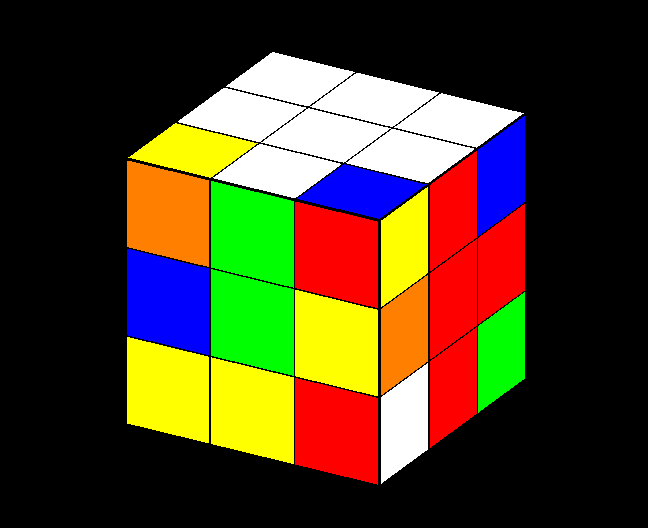

# RubiksCube

<div align="center">

</div>

<br>

<div align="center">


</div>

<br>

<div align="center">

[]()


[](https://wakatime.com/badge/user/a61b2181-3d29-486a-b232-a3254a04695d/project/c872bbde-ff39-44ac-ae54-07f790e4d666)

</div>

## Task:

Разработать программу, имитирующую сборку Кубика Рубика 3x3. Программа должна:

1. Сохранять и читать состояние Кубика Рубика из файла.
2. Проверять корректность текущего состояния (инвариант состояний Кубика).
3. Выводить текущее состояние в консоль.
4. Вращать грани Кубика Рубика с помощью вводимых команд.
5. Генерировать случайное состояние Кубика Рубика, соответствующее инвариантам состояний.
6. Находить "решение" для текущего состояния в виде последовательности поворотов граней.

**Основные параметры:**
- `--input_filename=<файл>` <i>(обязательный параметр)</i>: файл, содержащий начальное состояние Кубика Рубика.

## Project descripiton:

Данный проект представляет собой программу, имитирующую сборку Кубика Рубика 3x3. Программа включает в себя:

- Сохранение и чтение состояния Кубика Рубика из файла.
- Проверку корректности текущего состояния.
- Вывод текущего состояния в консоль.
- Вращение граней Кубика Рубика с помощью вводимых команд.
- Генерацию случайного состояния Кубика Рубика, соответствующего инвариантам.
- Нахождение решения для текущего состояния в виде последовательности поворотов граней.

## Functionality:

- **Сохранение и чтение состояния из файла:** Программа позволяет сохранить текущее состояние Кубика Рубика в файл и загрузить его обратно.
- **Проверка корректности состояния:** Проверяет правильность текущего состояния Кубика Рубика.
- **Вывод состояния:** Отображает текущее состояние Кубика Рубика в диалоговом окне или консоли.
- **Вращение граней:** Позволяет пользователю вращать грани Кубика Рубика с помощью команд.
- **Решение головоломки:** Находит решение для текущего состояния и предоставляет последовательность шагов для его сборки.

## Non-functional requirements:
- Программа спроектирована с использованием ООП.
- Логические сущности выделены в отдельные классы.
- Применены возможности языка программирования C++, включая стандартную библиотеку.

## Visualization:
- Реализован графический интерфейс с использованием OpenGL Utility Toolkit (GLUT).

## Project structure:
```md
.
├── CMakeLists.txt
├── README.md
├── LICENSE.md
├── include
│   ├── solver
│   │   ├── CLIParameters.h
│   │   ├── CubeSolver.h
│   │   └── StateManager.h
│   └── visual
│       └── CubeRenderer.h
└── src
   ├── main.cpp
   └── solver
       ├── CLIParameters.cpp
       ├── CubeSolver.cpp
       └── StateManager.cpp
```

## Description of files:
- **`CLIParameters.h` и `CLIParameters.cpp`** - Класс для обработки и валидации аргументов командной строки.
- **`CubeSolver.h` и `CubeSolver.cpp`** - Класс, представляющий Кубик Рубика и методы для его решения.
- **`StateManager.h` и `StateManager.cpp`** - Класс для управления начальным состоянием Кубика Рубика, загружаемого из файла.
- **`CubeRenderer.h`** - Класс для рендеринга Кубика Рубика с использованием OpenGL.
- **`main.cpp`** - Основной файл программы, где осуществляется запуск программы, инициализация рендеринга и обработка пользовательского ввода.

## Example input data:
Пример файла состояния Кубика Рубика:

```md
G G G
G G G
G G G

O O O
O O O
O O O

R R R
R R R
R R R

B B B
B B B
B B B

W W W
W W W
W W W

Y Y Y
Y Y Y
Y Y Y
```

## Requirements:
- `CMake 3.27` или выше
- `OpenGL`
- `GLUT`
- `GLEW`
- `GLFW`

## Control:
- **Повороты граней:**
    - Верхняя грань: a (по часовой) / q (против часовой)
    - Правая грань: s (по часовой) / w (против часовой)
    - Передняя грань: d (по часовой) / e (против часовой)
    - Левая грань: f (по часовой) / r (против часовой)
    - Задняя грань: g (по часовой) / t (против часовой)
    - Нижняя грань: h (по часовой) / y (против часовой)
- **Повороты всего кубика:**
    - Вверх: 8
    - Вниз: 2
    - Влево: 4
    - Вправо: 6
    - Вращение: 1 (по часовой) / 9 (против часовой)
    - Сброс вращения: 5
- **Шаги решения:**
    - Следующий шаг: ESC

## Algorithm for solving the Rubik's Cube:
Для разработки и реализации алгоритмов сборки использовался сайт с туториалом:
https://cccstore.ru/school/kubik-rubika-3x3x3/beginners/

Программа использует классический алгоритм для сборки Кубика Рубика, который делится на несколько этапов:

1. **Сборка белого креста:**
    - **Первый этап белого креста:** Совмещение белых краев с центральным белым элементом.
    <div align="center">
    
    </div>

    - **Второй этап белого креста:** Коррекция положения краев белого креста, чтобы они совпадали с центральными элементами боковых граней.
    <div align="center">
    
    </div>
2. **Сборка белых углов:**
    - **GWR угол:** Установка углового элемента с цветами зелёный, белый, красный.
    - **RWB угол:** Установка углового элемента с цветами красный, белый, синий.
    - **BWO угол:** Установка углового элемента с цветами синий, белый, оранжевый.
    - **OWG угол:** Установка углового элемента с цветами оранжевый, белый, зелёный.
    <div align="center">
    
    </div>
3. **Сборка средних слоев:**
    - **Зелёно-красная грань:** Установка бокового элемента с цветами зелёный, красный.
    - **Красно-синяя грань:** Установка бокового элемента с цветами красный, синий.
    - **Сине-оранжевая грань:** Установка бокового элемента с цветами синий, оранжевый.
    - **Оранжево-зелёная грань:** Установка бокового элемента с цветами оранжевый, зелёный.
    <div align="center">
    
    </div>
4. **Сборка желтого креста:**
    - **Cитуация "Желтая палочка":** Формирование жетого креста из желтой палочки.
    - **Cитуация "Желтая галочка":** Формирование жетого креста из желтой галочки.
    - **Cитуация "Желтая точка":** Формирование жетого креста из желтой точки.
    <div align="center">
    
    </div>
5. **Сборка желтых углов:**
    - **Проверка количества желтых рёбер:** Подсчёт количества правильных желтых рёбер.
    - **Решение желтых углов:** Установка угловых элементов на правильные позиции.
    - **Цветная корректировка желтых углов:** Коррекция цветовой ориентации угловых элементов.
    <div align="center">
    
    </div>

    <div align="center">
    
    </div>

    <div align="center">
    
    </div>

## Screencast
<div align="center">

</div>    

## OpenGL theory:

Для рендеринга Кубика Рубика используется OpenGL. Основные аспекты логики, используемой в коде:

### Initializing OpenGL:

- **glutInit**:
  - **Описание**: Инициализирует библиотеку GLUT, которая упрощает создание приложений с графическим интерфейсом, используя OpenGL.
  - **Под капотом**: Настраивает среду выполнения, парсит аргументы командной строки для обработки специальных опций GLUT, таких как параметры окна и режима отображения.
  - **Зачем нужно**: Это начальный шаг, подготавливающий GLUT к работе, позволяя использовать другие функции библиотеки для создания окон и управления ими.
  - **Пример использования**:
    ```cpp
    int argc = 1;
    char *argv[1] = {(char*)"Something"};
    glutInit(&argc, argv);
    ```
  - **Советы**: Убедитесь, что все параметры командной строки корректны и совместимы с GLUT.

- **glutInitDisplayMode**:
  - **Описание**: Устанавливает режим отображения окна.
  - **Под капотом**: Определяет, какие буферы будут использоваться (например, буфер цвета, буфер глубины), и указывает на использование двойной буферизации для плавного отображения.
  - **Зачем нужно**: Позволяет настроить основные параметры отображения, что важно для правильной визуализации сцены.
  - **Пример использования**:
    ```cpp
    glutInitDisplayMode(GLUT_DOUBLE | GLUT_RGB | GLUT_DEPTH);
    ```
  - **Советы**: Используйте `GLUT_DOUBLE` для двойной буферизации, что обеспечивает плавное обновление экрана.

- **glutInitWindowSize**:
  - **Описание**: Устанавливает размер окна при его создании.
  - **Под капотом**: Передает параметры ширины и высоты в GLUT, которые будут использованы при создании окна.
  - **Зачем нужно**: Определяет начальные размеры окна, что важно для правильного позиционирования и масштабирования сцены.
  - **Пример использования**:
    ```cpp
    glutInitWindowSize(800, 600);
    ```
  - **Советы**: Выбирайте размеры окна, которые соответствуют разрешению экрана и требованиям приложения.

- **glutCreateWindow**:
  - **Описание**: Создает окно с указанным заголовком.
  - **Под капотом**: Вызывает функции системы окон для создания окна с OpenGL контекстом.
  - **Зачем нужно**: Основной способ создания окна, где будет происходить рендеринг сцены.
  - **Пример использования**:
    ```cpp
    glutCreateWindow("Rubik's Cube Solver");
    ```
  - **Советы**: Убедитесь, что заголовок окна отражает суть приложения.

- **glutDisplayFunc**:
  - **Описание**: Устанавливает функцию обратного вызова для отображения.
  - **Под капотом**: Регистрация функции, которая будет вызвана всякий раз, когда необходимо перерисовать окно.
  - **Зачем нужно**: Позволяет определить, что именно и как будет отрисовываться в окне.
  - **Пример использования**:
    ```cpp
    glutDisplayFunc(display);
    ```
  - **Советы**: Функция обратного вызова `display` должна содержать код для рендеринга всей сцены.

- **glutReshapeFunc**:
  - **Описание**: Устанавливает функцию обратного вызова для обработки изменения размеров окна.
  - **Под капотом**: Регистрация функции, которая будет вызвана при каждом изменении размеров окна, передавая новые размеры.
  - **Зачем нужно**: Обеспечивает правильное обновление сцены при изменении размеров окна, поддерживая правильные пропорции и масштаб.
  - **Пример использования**:
    ```cpp
    glutReshapeFunc(reshape);
    ```
  - **Советы**: Убедитесь, что функция `reshape` корректно обрабатывает все возможные размеры окна.

- **glutKeyboardFunc**:
  - **Описание**: Устанавливает функцию обратного вызова для обработки нажатий клавиш.
  - **Под капотом**: Регистрация функции, которая будет вызвана при каждом нажатии клавиши, передавая информацию о нажатой клавише и положении курсора.
  - **Зачем нужно**: Позволяет обрабатывать ввод с клавиатуры, что важно для взаимодействия пользователя с приложением, например, для управления вращением Кубика Рубика.
  - **Пример использования**:
    ```cpp
    glutKeyboardFunc(keyboard);
    ```
  - **Советы**: Обрабатывайте все необходимые клавиши и убедитесь, что приложение корректно реагирует на каждое нажатие.

### Rendering of a Rubik's Cube:

- **glLoadIdentity**:
  - **Описание**: Сбрасывает текущую матрицу на единичную матрицу.
  - **Под капотом**: Устанавливает текущую матрицу в состояние, в котором все преобразования сбрасываются, и матрица становится единичной.
  - **Зачем нужно**: Это необходимо для начала нового набора преобразований, обеспечивая, что предыдущие преобразования не повлияют на текущие.
  - **Пример использования**:
    ```cpp
    glLoadIdentity();
    ```
  - **Советы**: Используйте после установки матрицы модели-вида или проекции для сброса предыдущих преобразований.

- **glPushMatrix** и **glPopMatrix**:
  - **Описание**: Сохранение (**glPushMatrix**) и восстановление (**glPopMatrix**) текущей матрицы.
  - **Под капотом**: **glPushMatrix** копирует текущую матрицу и помещает ее на стек, а **glPopMatrix** восстанавливает последнюю сохраненную матрицу из стека.
  - **Зачем нужно**: Позволяет сохранить текущую матрицу перед применением новых преобразований и восстановить её после, что полезно при работе с вложенными объектами.
  - **Пример использования**:
    ```cpp
    glPushMatrix();
    // Применение преобразований
    glPopMatrix();
    ```
  - **Советы**: Всегда используйте **glPushMatrix** перед началом преобразований и **glPopMatrix** после их завершения для обеспечения целостности матриц.

- **glRotatef**:
  - **Описание**: Выполняет вращение по указанной оси на заданный угол.
  - **Под капотом**: Применяет вращение к текущей матрице преобразования, изменяя ориентацию объектов.
  - **Зачем нужно**: Используется для вращения объектов в сцене вокруг осей X, Y или Z.
  - **Пример использования**:
    ```cpp
    glRotatef(45.0, 1.0, 0.0, 0.0); // Вращение на 45 градусов вокруг оси X
    ```
  - **Советы**: Убедитесь, что ось вращения нормализована (имеет единичную длину).

- **glBegin** и **glEnd**:
  - **Описание**: Определяет начало (**glBegin**) и конец (**glEnd**) набора вершин для примитивов.
  - **Под капотом**: **glBegin** начинает определение примитивов, таких как точки, линии или полигоны, а **glEnd** завершает это определение.
  - **Зачем нужно**: Эти функции определяют блок, в котором указываются вершины для создания геометрических объектов.
  - **Пример использования**:
    ```cpp
    glBegin(GL_QUADS);
    // Определение вершин
    glEnd();
    ```
  - **Советы**: Всегда используйте **glEnd** после завершения определения вершин, чтобы закрыть блок **glBegin**.

- **glColor3fv**:
  - **Описание**: Устанавливает текущий цвет.
  - **Под капотом**: Принимает массив из трех значений (RGB) и устанавливает их в качестве текущего цвета для последующих примитивов.
  - **Зачем нужно**: Позволяет задавать цвет для вершин и примитивов, которые будут отрисованы.
  - **Пример использования**:
    ```cpp
    GLfloat color[] = {1.0f, 0.0f, 0.0f}; // Красный цвет
    glColor3fv(color);
    ```
  - **Советы**: Убедитесь, что значения RGB находятся в диапазоне от 0.0 до 1.0.

- **glVertex3fv**:
  - **Описание**: Определяет вершину в 3D пространстве.
  - **Под капотом**: Принимает массив из трех координат (X, Y, Z) и добавляет вершину в текущий примитив.
  - **Зачем нужно**: Используется для указания положения вершин примитивов, таких как треугольники или квадраты, в пространстве.
  - **Пример использования**:
    ```cpp
    GLfloat vertex[] = {0.0f, 0.0f, 0.0f};
    glVertex3fv(vertex);
    ```
  - **Советы**: Координаты вершин должны быть определены в правильном порядке для корректного отображения примитивов.

### Working with matrices:

- **glMatrixMode**:
  - **Описание**: Устанавливает текущую матрицу, с которой будут выполняться последующие операции.
  - **Под капотом**: Принимает один из следующих параметров:
    - `GL_PROJECTION`: Устанавливает матрицу проекции, которая определяет, как сцена проецируется на экран.
    - `GL_MODELVIEW`: Устанавливает матрицу модели-вида, которая управляет преобразованиями объектов в сцене.
    - `GL_TEXTURE`: Устанавливает матрицу текстуры, используемую для текстурных координат.
  - **Зачем нужно**: Позволяет переключаться между разными матрицами для управления проекцией, видом и текстурами.

- **glOrtho**:
  - **Описание**: Устанавливает параметры ортографической проекции.
  - **Под капотом**: Задает параллельную проекцию, где размеры объектов не изменяются с расстоянием.
  - **Синтаксис**: `glOrtho(left, right, bottom, top, near, far)`
    - `left`, `right`: Левая и правая границы области просмотра.
    - `bottom`, `top`: Нижняя и верхняя границы области просмотра.
    - `near`, `far`: Ближняя и дальняя границы области просмотра.
  - **Зачем нужно**: Используется для задания области отображения сцены без перспективных искажений, что удобно для 2D и некоторых 3D приложений.

- **glViewport**:
  - **Описание**: Устанавливает область просмотра на экране.
  - **Под капотом**: Определяет прямоугольную область окна, куда будет отображаться конечное изображение.
  - **Синтаксис**: `glViewport(x, y, width, height)`
    - `x`, `y`: Координаты нижнего левого угла области просмотра.
    - `width`, `height`: Ширина и высота области просмотра.
  - **Зачем нужно**: Позволяет настроить, какая часть окна будет использована для рендеринга, что важно для корректного отображения сцены при изменении размеров окна.

### Working with Buffers:

- **glEnable(GL_DEPTH_TEST)**:
  - **Описание**: Включает тест глубины, который позволяет правильно отрисовывать объекты в зависимости от их удаленности от камеры.
  - **Под капотом**: Активирует буфер глубины, позволяя OpenGL автоматически учитывать глубину каждого пикселя, чтобы определить, какие части объектов видны, а какие скрыты за другими объектами.
  - **Зачем нужно**: Обеспечивает корректное отображение объектов в 3D пространстве, предотвращая прорисовку скрытых поверхностей.
  - **Пример использования**:
    ```cpp
    glEnable(GL_DEPTH_TEST);
    ```
  - **Советы**: Убедитесь, что тест глубины включен до начала рендеринга сцены, чтобы избежать артефактов отображения.

- **glClear**:
  - **Описание**: Очищает указанные буферы, такие как буфер цвета и буфер глубины.
  - **Под капотом**: Принимает битовую маску, определяющую, какие буферы нужно очистить (например, `GL_COLOR_BUFFER_BIT` для буфера цвета и `GL_DEPTH_BUFFER_BIT` для буфера глубины).
  - **Зачем нужно**: Обеспечивает очистку экрана и буфера глубины перед началом нового кадра, чтобы старые данные не мешали текущему рендерингу.
  - **Пример использования**:
    ```cpp
    glClear(GL_COLOR_BUFFER_BIT | GL_DEPTH_BUFFER_BIT);
    ```
  - **Советы**: Регулярно вызывайте **glClear** в функции отображения перед началом рендеринга новой сцены.

- **glFlush** и **glutSwapBuffers**:
  - **glFlush**:
    - **Описание**: Обеспечивает выполнение всех команд отрисовки, отправленных в OpenGL.
    - **Под капотом**: Гарантирует, что все команды отрисовки, помещенные в очередь, будут выполнены в ближайшее время.
    - **Зачем нужно**: Полезно для обеспечения завершения всех команд рендеринга до отображения результата.
    - **Пример использования**:
      ```cpp
      glFlush();
      ```
    - **Советы**: Используйте в однобуферных приложениях для обеспечения завершения всех команд.

  - **glutSwapBuffers**:
    - **Описание**: Меняет местами передний и задний буферы.
    - **Под капотом**: Включает двойную буферизацию, где рендеринг происходит в скрытом заднем буфере, а затем буферы меняются местами, обеспечивая плавное обновление экрана.
    - **Зачем нужно**: Обеспечивает плавное и без миганий обновление экрана в двойной буферизации.
    - **Пример использования**:
      ```cpp
      glutSwapBuffers();
      ```
    - **Советы**: Используйте в функциях отображения, чтобы завершить процесс рендеринга кадра и обновить экран.

### Handling user input:


- **glutMouseFunc**:
  - **Описание**: Устанавливает функцию обратного вызова для обработки событий мыши, таких как нажатия кнопок.
  - **Под капотом**: Функция обратного вызова принимает три параметра: кнопку мыши, состояние кнопки и текущие координаты указателя.
  - **Зачем нужно**: Позволяет реагировать на действия пользователя с мышью, например, для управления интерактивными элементами сцены.
  - **Пример использования**:
    ```cpp
    void mouseHandler(int button, int state, int x, int y) {
        if (button == GLUT_LEFT_BUTTON && state == GLUT_DOWN) {
            // Обработка нажатия левой кнопки мыши
        }
    }
    glutMouseFunc(mouseHandler);
    ```
  - **Советы**: Помните о различных состояниях кнопок мыши, таких как `GLUT_DOWN` и `GLUT_UP`, и учитывайте положение курсора для точной реакции.

- **glutMotionFunc**:
  - **Описание**: Устанавливает функцию обратного вызова для обработки перемещений мыши при нажатой кнопке.
  - **Под капотом**: Функция обратного вызова принимает координаты указателя мыши в момент его движения.
  - **Зачем нужно**: Используется для отслеживания и реагирования на перемещение мыши, что полезно для задач, требующих драг-н-дроп или точного контроля элементов.
  - **Пример использования**:
    ```cpp
    void motionHandler(int x, int y) {
        // Обработка перемещения мыши
    }
    glutMotionFunc(motionHandler);
    ```
  - **Советы**: Эта функция особенно полезна в приложениях, где перемещение мыши напрямую влияет на элементы интерфейса или объекты в сцене.

- **glutIdleFunc**:
  - **Описание**: Устанавливает функцию обратного вызова, которая вызывается, когда система находится в состоянии простоя (нет других событий для обработки).
  - **Под капотом**: Эта функция может использоваться для выполнения фоновых задач или обновления сцены.
  - **Зачем нужно**: Полезно для анимации, автоматического обновления или выполнения длительных расчетов без блокировки интерфейса.
  - **Пример использования**:
    ```cpp
    void idleFunc() {
        // Код, выполняемый во время простоя системы
        glutPostRedisplay(); // Запрос на перерисовку сцены
    }
    glutIdleFunc(idleFunc);
    ```
  - **Советы**: Используйте `glutIdleFunc` с осторожностью, так как чрезмерное количество действий в функции простоя может привести к повышенной загрузке процессора.

### Secondary functions:

- **polygon**:
  - **Описание**: Определяет полигон, задавая его цвет и вершины.
  - **Под капотом**: Функция принимает пять параметров: индекс цвета и четыре индекса вершин, затем устанавливает цвет и рисует полигон с указанными вершинами.
  - **Зачем нужно**: Упрощает создание полигонов с заданными вершинами и цветом, что удобно для построения сложных геометрических фигур.
  - **Пример использования**:
    ```cpp
    void polygon(int a, int b, int c, int d, int e) {
        glColor3f(0, 0, 0);
        glLineWidth(3.0);
        glBegin(GL_LINE_LOOP);
        glVertex3fv(vertices[b]);
        glVertex3fv(vertices[c]);
        glVertex3fv(vertices[d]);
        glVertex3fv(vertices[e]);
        glEnd();

        glColor3fv(color[a]);
        glBegin(GL_POLYGON);
        glVertex3fv(vertices[b]);
        glVertex3fv(vertices[c]);
        glVertex3fv(vertices[d]);
        glVertex3fv(vertices[e]);
        glEnd();
    }
    ```
  - **Советы**: Убедитесь, что индексы вершин и цвета корректно соответствуют массивам `vertices` и `color`.

- **colorcube**:
  - **Описание**: Определяет цветные кубики для каждой грани Кубика Рубика.
  - **Под капотом**: Функция вызывает **polygon** для каждой грани кубика, используя заранее определенные вершины и цвета для каждой из шести граней.
  - **Зачем нужно**: Позволяет визуализировать каждую грань Кубика Рубика, назначая каждой грани соответствующий цвет.
  - **Пример использования**:
    ```cpp
    void colorcube1() {
        polygon(6, 0, 3, 2, 1);
        polygon(6, 2, 3, 7, 6);
        polygon(6, 0, 4, 7, 3); // center piece
        polygon(6, 1, 2, 6, 5);
        polygon(6, 4, 5, 6, 7);
        polygon(6, 0, 1, 5, 4);
    }
    ```
  - **Советы**: Разделите каждую грань кубика на шесть или девять полигонов для точного отображения структуры Кубика Рубика.

### Differences between OpenGL data types and standard data types

В OpenGL используются собственные типы данных, такие как `GLfloat`, `GLint`, и другие, которые представляют собой обертки вокруг стандартных типов данных языка программирования C/C++. Эти типы данных введены для обеспечения кроссплатформенной совместимости и обеспечения согласованности во всех реализациях OpenGL.

- **GLfloat**:
  - **Описание**: Представляет вещественное число с плавающей точкой.
  - **Эквивалент в C/C++**: `float`.
  - **Использование**: Используется для определения координат вершин, цветов и других параметров, требующих точности с плавающей точкой.
  - **Пример**:
    ```cpp
    GLfloat vertex[] = {1.0f, 2.0f, 3.0f};
    ```
  - **Преимущества**: Обеспечивает единообразие типа данных для всех реализаций OpenGL, гарантируя корректную работу на всех платформах.

- **GLint**:
  - **Описание**: Представляет целое число.
  - **Эквивалент в C/C++**: `int`.
  - **Использование**: Используется для задания индексов, размеров и других параметров, требующих целочисленных значений.
  - **Пример**:
    ```cpp
    GLint width = 800;
    GLint height = 600;
    ```
  - **Преимущества**: Обеспечивает кроссплатформенную совместимость, что важно для работы OpenGL на различных архитектурах.

- **GLdouble**:
  - **Описание**: Представляет вещественное число с двойной точностью.
  - **Эквивалент в C/C++**: `double`.
  - **Использование**: Используется для задания координат и других параметров, требующих высокой точности.
  - **Пример**:
    ```cpp
    GLdouble modelview[16];
    ```
  - **Преимущества**: Обеспечивает высокую точность вычислений, что важно для сложных графических операций.

- **GLshort**:
  - **Описание**: Представляет короткое целое число.
  - **Эквивалент в C/C++**: `short`.
  - **Использование**: Используется для оптимизации памяти при работе с большими массивами целых чисел.
  - **Пример**:
    ```cpp
    GLshort indices[] = {0, 1, 2};
    ```
  - **Преимущества**: Экономит память, особенно при работе с индексными массивами.

- **GLubyte**:
  - **Описание**: Представляет беззнаковое байтовое значение.
  - **Эквивалент в C/C++**: `unsigned char`.
  - **Использование**: Используется для задания значений цвета, текстур и других параметров, требующих беззнаковых значений.
  - **Пример**:
    ```cpp
    GLubyte color[] = {255, 128, 64};
    ```
  - **Преимущества**: Подходит для представления цветовых компонентов и других данных, где требуется беззнаковое значение.

- **GLuint**:
  - **Описание**: Представляет беззнаковое целое число.
  - **Эквивалент в C/C++**: `unsigned int`.
  - **Использование**: Используется для задания идентификаторов объектов, таких как текстуры и буферы.
  - **Пример**:
    ```cpp
    GLuint textureID;
    ```
  - **Преимущества**: Гарантирует уникальность и корректность идентификаторов в контексте OpenGL.

### Benefits of Using OpenGL Data Types

- **Кроссплатформенная совместимость**: Эти типы данных обеспечивают, что код будет работать на различных архитектурах и операционных системах без необходимости модификации.
- **Согласованность**: Использование стандартных типов данных OpenGL способствует поддержанию единообразия в коде и улучшает читаемость.
- **Оптимизация**: Некоторые типы, такие как `GLshort` и `GLubyte`, помогают оптимизировать использование памяти и улучшить производительность.

### Examples of using OpenGL data types

- **Определение вершины с цветом**:
  ```cpp
  GLfloat vertex[] = {0.0f, 1.0f, 0.0f};
  GLfloat color[] = {1.0f, 0.0f, 0.0f}; // Красный цвет
  glColor3fv(color);
  glVertex3fv(vertex);