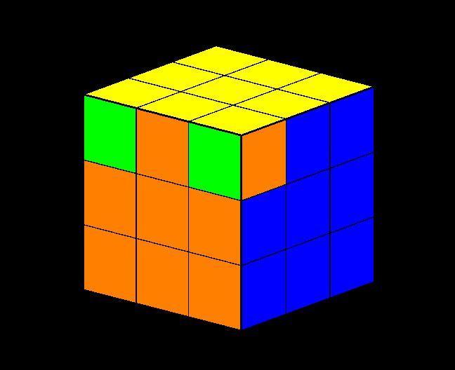

# RubiksCube

<div align="center">

</div>

<br>

<div align="center">


</div>

<br>

<div align="center">

[]()


</div>

## Task:

Разработать программу, имитирующую сборку Кубика Рубика 3x3. Программа должна:

1. Сохранять и читать состояние Кубика Рубика из файла.
2. Проверять корректность текущего состояния (инвариант состояний Кубика).
3. Выводить текущее состояние в консоль.
4. Вращать грани Кубика Рубика с помощью вводимых команд.
5. Генерировать случайное состояние Кубика Рубика, соответствующее инвариантам состояний.
6. Находить "решение" для текущего состояния в виде последовательности поворотов граней.

**Основные параметры:**
- `--input_filename=<файл>` <i>(обязательный параметр)</i>: файл, содержащий начальное состояние Кубика Рубика.

## Project descripiton:

Данный проект представляет собой программу, имитирующую сборку Кубика Рубика 3x3. Программа включает в себя:

- Сохранение и чтение состояния Кубика Рубика из файла.
- Проверку корректности текущего состояния.
- Вывод текущего состояния в консоль.
- Вращение граней Кубика Рубика с помощью вводимых команд.
- Генерацию случайного состояния Кубика Рубика, соответствующего инвариантам.
- Нахождение решения для текущего состояния в виде последовательности поворотов граней.

## Functionality:

- **Сохранение и чтение состояния из файла:** Программа позволяет сохранить текущее состояние Кубика Рубика в файл и загрузить его обратно.
- **Проверка корректности состояния:** Проверяет правильность текущего состояния Кубика Рубика.
- **Вывод состояния:** Отображает текущее состояние Кубика Рубика в диалоговом окне или консоли.
- **Вращение граней:** Позволяет пользователю вращать грани Кубика Рубика с помощью команд.
- **Решение головоломки:** Находит решение для текущего состояния и предоставляет последовательность шагов для его сборки.

## Non-functional requirements:
- Программа спроектирована с использованием ООП.
- Логические сущности выделены в отдельные классы.
- Применены возможности языка программирования C++, включая стандартную библиотеку.

## Visualization:
- Реализован графический интерфейс с использованием OpenGL Utility Toolkit (GLUT).

## Project structure:
```md
.
├── CMakeLists.txt
├── README.md
├── LICENSE.md
├── include
│   ├── solver
│   │   ├── CLIParameters.h
│   │   ├── CubeSolver.h
│   │   └── StateManager.h
│   └── visual
│       └── CubeRenderer.h
└── src
   ├── main.cpp
   └── solver
       ├── CLIParameters.cpp
       ├── CubeSolver.cpp
       └── StateManager.cpp
```

## Description of files:
- **`CLIParameters.h` и `CLIParameters.cpp`** - Класс для обработки и валидации аргументов командной строки.
- **`CubeSolver.h` и `CubeSolver.cpp`** - Класс, представляющий Кубик Рубика и методы для его решения.
- **`StateManager.h` и `StateManager.cpp`** - Класс для управления начальным состоянием Кубика Рубика, загружаемого из файла.
- **`CubeRenderer.h`** - Класс для рендеринга Кубика Рубика с использованием OpenGL.
- **`main.cpp`** - Основной файл программы, где осуществляется запуск программы, инициализация рендеринга и обработка пользовательского ввода.

## Example input data:
Пример файла состояния Кубика Рубика:

```md
G G G
G G G
G G G

O O O
O O O
O O O

R R R
R R R
R R R

B B B
B B B
B B B

W W W
W W W
W W W

Y Y Y
Y Y Y
Y Y Y
```

## Requirements:
- `CMake 3.27` или выше
- `OpenGL`
- `GLUT`
- `GLEW`
- `GLFW`

## Control:
- **Повороты граней:**
    - Верхняя грань: a (по часовой) / q (против часовой)
    - Правая грань: s (по часовой) / w (против часовой)
    - Передняя грань: d (по часовой) / e (против часовой)
    - Левая грань: f (по часовой) / r (против часовой)
    - Задняя грань: g (по часовой) / t (против часовой)
    - Нижняя грань: h (по часовой) / y (против часовой)
- **Повороты всего кубика:**
    - Вверх: 8
    - Вниз: 2
    - Влево: 4
    - Вправо: 6
    - Вращение: 1 (по часовой) / 9 (против часовой)
    - Сброс вращения: 5
- **Шаги решения:**
    - Следующий шаг: ESC

## Algorithm for solving the Rubik's Cube:
Программа использует классический алгоритм для сборки Кубика Рубика, который делится на несколько этапов:

1. **Сборка белого креста:**
    - **Первый этап белого креста:** Совмещение белых краев с центральным белым элементом.
    <div align="center">
    
    </div>

    - **Второй этап белого креста:** Коррекция положения краев белого креста, чтобы они совпадали с центральными элементами боковых граней.
    <div align="center">
    
    </div>
2. **Сборка белых углов:**
    - **GWR угол:** Установка углового элемента с цветами зелёный, белый, красный.
    - **RWB угол:** Установка углового элемента с цветами красный, белый, синий.
    - **BWO угол:** Установка углового элемента с цветами синий, белый, оранжевый.
    - **OWG угол:** Установка углового элемента с цветами оранжевый, белый, зелёный.
    <div align="center">
    
    </div>
3. **Сборка средних слоев:**
    - **Зелёно-красная грань:** Установка бокового элемента с цветами зелёный, красный.
    - **Красно-синяя грань:** Установка бокового элемента с цветами красный, синий.
    - **Сине-оранжевая грань:** Установка бокового элемента с цветами синий, оранжевый.
    - **Оранжево-зелёная грань:** Установка бокового элемента с цветами оранжевый, зелёный.
    <div align="center">
    
    </div>
4. **Сборка желтого креста:**
    - **Cитуация "Желтая палочка":** Формирование жетого креста из желтой палочки.
    - **Cитуация "Желтая галочка":** Формирование жетого креста из желтой галочки.
    - **Cитуация "Желтая точка":** Формирование жетого креста из желтой точки.
    <div align="center">
    
    </div>
5. **Сборка желтых углов:**
    - **Проверка количества желтых рёбер:** Подсчёт количества правильных желтых рёбер.
    - **Решение желтых углов:** Установка угловых элементов на правильные позиции.
    - **Цветная корректировка желтых углов:** Коррекция цветовой ориентации угловых элементов.
    <div align="center">
    
    </div>

    <div align="center">
    
    </div>

    <div align="center">
    
    </div>
    
Для разработки и реализации алгоритмов сборки использовался сайт с туториалом:
https://cccstore.ru/school/kubik-rubika-3x3x3/beginners/

## Screencast
<div align="center">

</div>